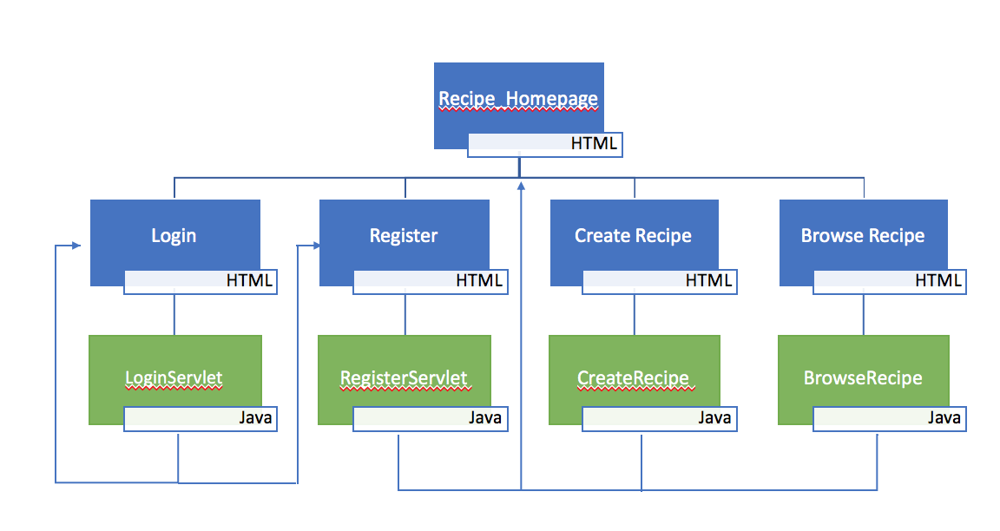

# EE419
Deirdre Reilly EE417: WebApplication Project Report 
Deirdre Reilly - 11304481

# Recipe Storage System
I was randomly assigned the "Recipe Storage System"". My application can register new users, login users, create recipes, and browse exisiting recipes.

Creating User Database:  
CREATE TABLE DRusers (
accountId INTEGER NOT NULL UNIQUE, 
name varchar(30),
email varchar(30),
password varchar(30),
PRIMARY KEY (accountId)
)

Creating Recipes Database:
CREATE TABLE DRrecipes (name varchar(100),
category varchar(50),
preparation_time number(5),
instructions varchar(1000),
ingredient1 varchar(100),
ingredient2 varchar(100),
ingredient3 varchar(100),
ingredient4 varchar(100),
ingredient5 varchar(100),
quantity1 number(5),
quantity2 number(5),
quantity3 number(5),
quantity4 number(5),
quantity5 number(5),
recipe_id number(5)
)					        
   
# The Web Application Design
The home page of my application is the first page the user sees that gives them an introduction to the website and allows them to navigate to the other functions of the website.

The first step is to login to the system if they are an existing user.A servlet checks if the entered user details match any records in the SQL database. If the users details are found in the table, the user gets a message to say the login details are correct. The user can click to go back to the home page of the website.A HTTP session is created and assigned to the logged in user.

If the incorrect login details are entered, the user is prompted with a message to check details and can click to try again. The user also has the option to register as a new user.
	
The User can register as a new user and enter their name, email and password. The servlet then takes this information and inserts the data into the users table. A unique key is generate and inserted into the accountID field in the table.
	
A user can create their own 5 ingredient recipe. They have mandatory fields to fill in such as name, category, preparation time, and instructions.
The user then fills in up to 5 ingredients, quantity, and units. The text fields are inputed with a blank value, as if the recipe is less than 5 ingredients, they can be sent to the database as blank values. 
The servlet then inserts the values into table. Once the recipe is saved the user is prompted with a message that the recipe is saved and can return to the homepage. 
	
The user can browse existing recipes in the system. There are 3 different ways to browse recipes. 

The first option is to search the name of the recipe or search the ingredient in the recipe. The servlet uses a LIKE condition to search the name and ingredient fields in the table. It then presents the results in a table with all the information from the table.
The second option is to search by category. The user can search for breakfast/snacks/main course etc.. It will pull up recipes stored under that category.
The third option is to search all exisiting recipes. The servlet selects all recipes in the recipe table.
	
There are several validation checks used throughout the application.
When registering a new user there is a check to ensure there are no blank fields, as well as to ensure there is a valid email address entered.
When creating a recipe there is another validation check to ensure the four mandatory fields are not blank.
	
	
Future Improvements
The project can expanded in the following ways:  The recipe table could contain a field that lists the user that created the recipe.
This could be used so the user could then filter to only recipes they have created. This would also create a link between the two tables (users and recipes).
A new field in the recipes table could be added for privacy. When the user is creating a recipe they could tick a box if they wish their recipe to be public. This would create a privacy option for the user. This would be stored as a boolean value in the table 

	
	
Servlets/HTML files and their associated servlets:
	index.html -> Recipe_homepage.html
	 Recipe_homepage -> Directs to Login/Register/CreateRecipe/BrowseRecipe.html files
	 Login.html -> LoginServlet.java
	 Register.html -> RegisterServlet.java
	 BrowseRecipe.html -> BrowseRecipe.java
	 CreateRecipe.html -> CreateRecipe.java

     

